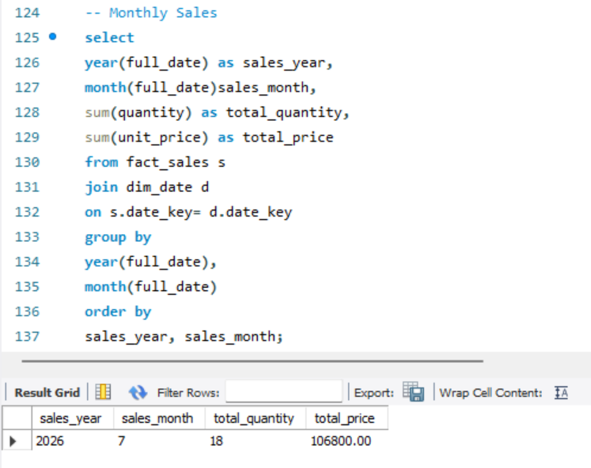
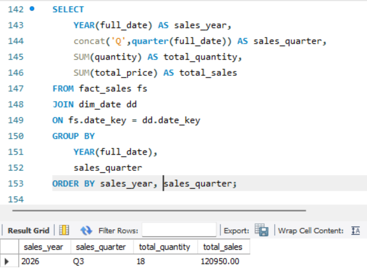
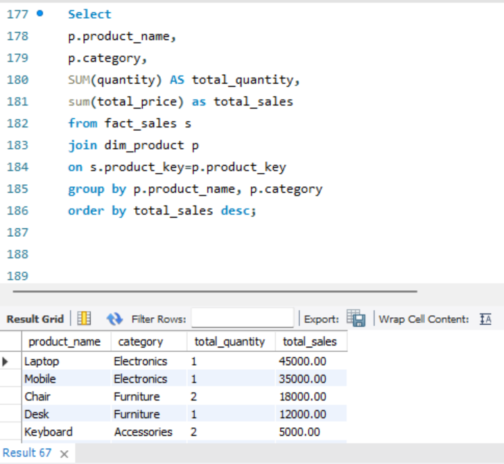
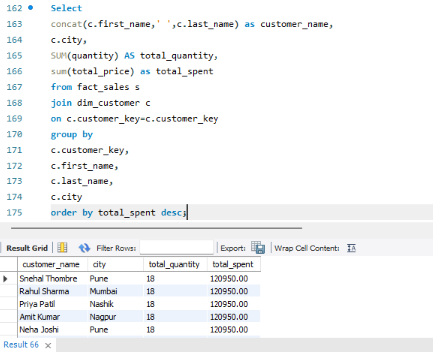
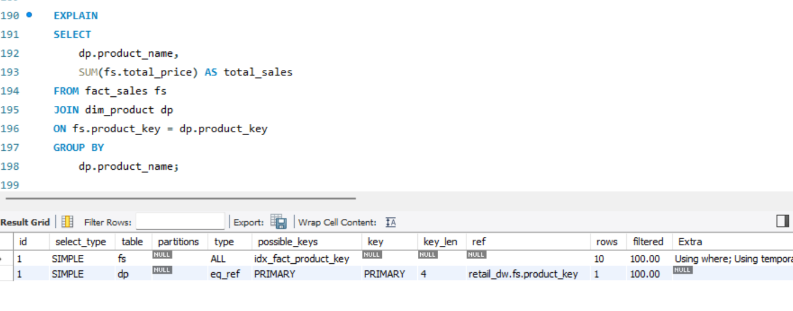
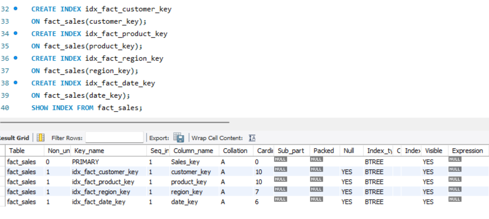

# 📊 Project 03 - Sales Reporting & Aggregation using SQL

## 📌 Overview

This project demonstrates how to generate business reports from a **Star Schema Data Warehouse** using SQL. It focuses on writing analytical queries to produce monthly, quarterly, yearly, customer, product, and regional sales reports while applying query optimization techniques.

The project uses the **retail_dw** database created in Project 02.

---

## 🎯 Objectives

- Generate Monthly Sales Reports
- Generate Quarterly Sales Reports
- Generate Yearly Sales Reports
- Identify Top Selling Products
- Identify Top Customers
- Generate Regional Sales Reports
- Filter aggregated results using HAVING
- Optimize queries using Indexes
- Analyze query execution using EXPLAIN

---

## 🛠️ Technologies Used

- MySQL
- SQL
- MySQL Workbench
- VS Code
- Git
- GitHub

---

## 🗂️ Project Structure

```text
Project03_SalesReporting_SQL/
│
├── sql/
│   ├── monthly_sales.sql
│   ├── quarterly_sales.sql
│   ├── yearly_sales.sql
│   ├── top_products.sql
│   ├── top_customers.sql
│   ├── regional_sales.sql
│   ├── having_sales.sql
│   └── indexes.sql
│
├── screenshots/
│
├── README.md
└── .gitignore
```

---

## 🏛️ Database Schema

The project uses the **retail_dw** Data Warehouse.

### Dimension Tables

- dim_customer
- dim_product
- dim_region
- dim_date

### Fact Table

- fact_sales

---

## 📈 Reports Generated

### 1. Monthly Sales Report

Displays:

- Sales Year
- Sales Month
- Total Quantity Sold
- Total Sales Revenue

---

### 2. Quarterly Sales Report

Displays:

- Sales Year
- Quarter
- Total Quantity Sold
- Total Sales Revenue

---

### 3. Yearly Sales Report

Displays:

- Sales Year
- Total Quantity Sold
- Total Sales Revenue

---

### 4. Top Products Report

Displays:

- Product Name
- Category
- Total Quantity Sold
- Total Sales Revenue

---

### 5. Top Customers Report

Displays:

- Customer Name
- City
- Total Quantity Purchased
- Total Amount Spent

---

### 6. Regional Sales Report

Displays:

- Region
- State
- Country
- Total Quantity Sold
- Total Sales Revenue

---

### 7. HAVING Clause Examples

Examples include:

- Products with sales greater than a specified amount
- Customers purchasing more than a specified quantity
- Regions exceeding a sales threshold

---

## ⚡ Query Optimization

The project demonstrates:

- Creating Indexes
- Using EXPLAIN
- Understanding Execution Plans
- Improving JOIN Performance

Example indexes:

```sql
CREATE INDEX idx_fact_customer_key ON fact_sales(customer_key);

CREATE INDEX idx_fact_product_key ON fact_sales(product_key);

CREATE INDEX idx_fact_region_key ON fact_sales(region_key);

CREATE INDEX idx_fact_date_key ON fact_sales(date_key);
```

---

## 📸 Project Screenshots

### 1️⃣ Monthly Sales Report

Generates monthly sales summary showing total quantity sold and total revenue.



---

### 2️⃣ Quarterly Sales Report

Aggregates sales by quarter for business reporting.



---

### 3️⃣ Yearly Sales Report

Displays yearly sales performance.


---

### 4️⃣ Top Products Report

Identifies the highest revenue-generating products.



---

### 5️⃣ Top Customers Report

Displays customers with the highest purchase value.



---

### 6️⃣ Regional Sales Report

Shows sales distribution across different regions.


---

### 7️⃣ HAVING Clause Examples

Demonstrates filtering aggregated data using the HAVING clause.


---

### 8️⃣ Query Optimization using EXPLAIN

The execution plan was analyzed using the `EXPLAIN` statement to understand how MySQL executes the query and whether indexes are being utilized.

```sql
EXPLAIN
SELECT
    dp.product_name,
    SUM(fs.total_price) AS total_sales
FROM fact_sales fs
JOIN dim_product dp
ON fs.product_key = dp.product_key
GROUP BY
    dp.product_name;
```



---

### 9️⃣ Indexes Created

Indexes were created on the foreign key columns of the `fact_sales` table to improve JOIN and filtering performance.

```sql
CREATE INDEX idx_fact_customer_key
ON fact_sales(customer_key);

CREATE INDEX idx_fact_product_key
ON fact_sales(product_key);

CREATE INDEX idx_fact_region_key
ON fact_sales(region_key);

CREATE INDEX idx_fact_date_key
ON fact_sales(date_key);
```

The indexes were verified using:

```sql
SHOW INDEX FROM fact_sales;
```



## 🚀 How to Run

1. Open MySQL Workbench or VS Code with SQLTools.
2. Connect to the `retail_dw` database.
3. Open any SQL script from the `sql` folder.
4. Execute the query.
5. Review the generated report.

---

## 📚 SQL Concepts Covered

- SELECT
- INNER JOIN
- GROUP BY
- HAVING
- ORDER BY
- Aggregate Functions
- SUM()
- YEAR()
- MONTH()
- MONTHNAME()
- QUARTER()
- CONCAT()
- CREATE INDEX
- EXPLAIN

---

## 📸 Sample Outputs

Store query result screenshots inside the `screenshots/` folder.

Examples:

- Monthly Sales Report
- Quarterly Sales Report
- Yearly Sales Report
- Top Products Report
- Top Customers Report
- Regional Sales Report
- EXPLAIN Output

---

## 🎓 Learning Outcomes

After completing this project, I gained practical experience in:

- Writing analytical SQL queries
- Building business reports
- Query optimization
- Index creation
- Reading execution plans
- Working with Star Schema data warehouses

---

## 📌 Author

**Snehal Thombre**

GitHub:
https://github.com/snehalwork

Thank you
